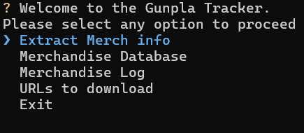

# Gunpla Tracker

Gunpla Tracker is a CLI-based app that keeps track of your favourite merchandise from anime/video games/ manga/ comic books from HobbyLinkJapan.

Originally, this was being made to keep track of build progress of gunpla (Gundam Model Kits), but I thought it would be better to expand it to action figures and other merch available.

# Installation

You can install the app through pip in Python by using

```
pip install .
```

# Tutorial

After installing the package locally, go into your terminal of choice by typing

```
gunpla-tracker
```

and press "Enter".

## Menu choices

Once you entered the command, you are presented with the following options



Extract Merch info : Extract the product information from the HobbylinkJapan urls provided in the "URLs to download option" and add into the Merchandise Database

Merchandise Database : This contains the list of merch that have been added.

Merchandise Log : A log that keeps track of the build status of your merch.

URLs to download : Provides an interface to paste the HobbylinkJapan urls (single and page-based).

Exit : We already know what this does.

## How to add merch to your database

1. Go to the "URLs to download" option. Add the URLs corresponding to the merch that you are planning to buy or are currently owning.
2. Press "ESC + Enter" to save and exit to the main menu, then go to "Extract Merch Info"
3. Wait for the program to download the product info to the database.
4. Go to the "Merchandise Database" to find your products. There, you are given an option to choose the type of search to use

   1. Advanced search lets you fine tune your search results to get what you want
   2. Basic search shows the entire table of products.

## How to track your merch in the "Merchandise Log"

1. Go to the "Merchandise Database" to find your products. There, you are given an option to choose the type of search to use
   1. Advanced search lets you fine tune your search results to get what you want
   2. Basic search shows the entire table of products.
2. Once you have decided on your merch, press "Enter". You are now given the option to add it to the tracking log.
3. If yes, then you can choose it's current build status. Once confirmed, it's then added to the log.
4. You can change the status of your chosen merch at any time by pressing "Enter" and choosing other options for your build.
5. If you want to remove the merch from your log, press the "Delete" key and confirm to remove the product from your log.
