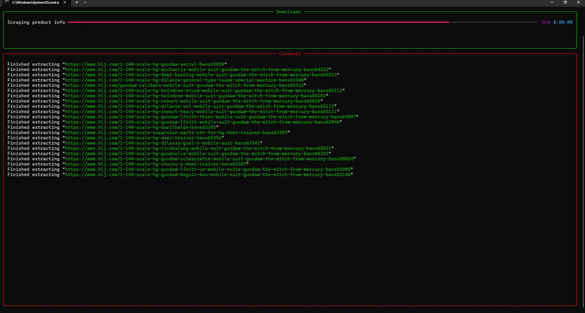

# Otonagai-dl

[**Otonagai**](https://www.tofugu.com/japanese/otonagai/)(大人買い）is a word used to describe people (mostly adults) who spend money on products marketed towards children (like gunpla, action figures, but we all know that).

Otonagai-dl is a CLI-based app that keeps track of your favourite merchandise from anime/video games/ manga/ comic books using product data from HobbylinkJapan.

Originally, this was being made to keep track of build progress of gunpla (Gundam Model Kits), but I thought it would be better to expand it to action figures and other merch available.




# Disclamer

This project is only meant for personal use and is only meant for the purpose of creating a log to keep track of merchandise.

This app scrapes only product information from HobbylinkJapan, respecting the robots.txt file along with the Terms and Conditions.

# Installation

You can install the app through pip in Python by using

```
pip install otonagai-dl
```

After installing the package locally, you can create a folder, open the terminal in that folder and type in

```
otonagai-dl
```

and press "Enter".

# Tutorial

For the tutorial, visit the following [wiki](https://weebmogul.gitbook.io/otonagai-dl/)
